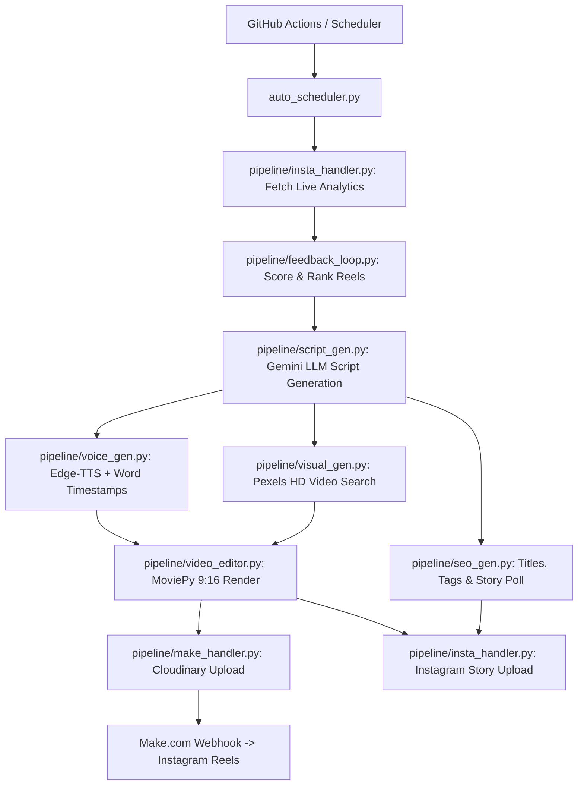

# 🎬 ReelForge-AI: Complete Pipeline Architecture & Gemini Review Prompt

This document provides a complete, component-by-component overview of the **ReelForge-AI** automated Instagram Reels platform, followed by a **Master Review Prompt** specifically designed for Gemini AI to analyze, critique, and optimize the pipeline and generated content.

---

## 📑 Part 1: Full System Architecture Overview



---

### 🔍 Component-by-Component Breakdown

#### 1. Autonomous Trigger & Scheduling (`auto_scheduler.py` & `auto-reels.yml`)
* **GitHub Actions Schedule:** Fires automatically at peak Indian scrolling hours (11:00 AM IST & 8:00 PM IST / `05:30 UTC` & `14:30 UTC`).
* **Atomic Execution:** Prevents race conditions with `reelforge-data-${{ github.ref_name }}-${{ github.run_id }}` cache keying so historical data persists without collisions.
* **Voice Rotation:** Automatically rotates TTS voices (`hi-IN-MadhurNeural` male deep voice & `hi-IN-SwaraNeural` female warm voice) using disk-persisted rotation tracking (`data/voice_index.txt`).
* **Topic Deduplication:** Logs all used topics to `data/used_topics.jsonl` to ensure topics are never repeated.

---

#### 2. Live Analytics & Feedback Engine (`feedback_loop.py` & `insta_handler.py`)
* **Live Fetching:** Connects to Instagram using session persistence (`insta_session.json` authenticated with user ID `75268454577`). Fetches recent Reel performance metrics (`views`, `likes`, `comments`, `shares`, `saves`).
* **Algorithmic Quality Scoring:** Calculates content rank using:
  $$\text{Score} = \text{Views} + (\text{Likes} \times 10) + (\text{Like Rate \%} \times 100)$$
  *Likes are weighted 10x for quality, and Like Rate is weighted 100x so high-engagement reels get recognized even if suppressed by the algorithm.*
* **Series Continuation Queue:** Automatically detects high-performing multi-part series (e.g., *Part 1: The Eye Contact Trap*) and queues *Part 2* for the next cycle.
* **Feedback Injection:** Summarizes top 5 hooks and bottom 3 angles, injecting this context directly into the Gemini script generation prompt.

---

#### 3. AI Script & Hook Generation (`script_gen.py`)
* **LLM Routing:** Uses OpenRouter with `google/gemini-2.5-flash` as primary model, backed by dynamic fallback models (`openai/gpt-4o-mini`, `google/gemini-2.0-pro-exp`, `meta-llama/llama-3.3-70b`).
* **Niche & Domain Focus:** Focuses on *Psychology of Attraction, Female Psychology, Hidden Behavioral Signals, and Relationship Dynamics*.
* **Psychological Hook Frameworks:**
  1. **Pattern Interrupt:** *"Stop scrolling if she made eye contact twice..."*
  2. **Contrarian Truth:** *"You think she's playing hard to get? You're completely wrong."*
  3. **Curiosity Gap:** *"There's 1 touch signal that 90% of guys misunderstand..."*
* **Output Payload:** Returns a structured JSON payload containing:
  * `scenes`: List of text snippets, duration, visual keywords, and visual mood (`dark`, `calm`, `intense`, `mystery`).
  * Continuous voice narration text for seamless TTS output.

---

#### 4. Audio Narration & Subtitle Sync (`voice_gen.py`)
* **TTS Engine:** Edge-TTS generating high-fidelity Hindi/Hinglish audio narration.
* **Word-Level Timestamps:** Generates a precise timeline array `[{word, start_time, end_time}]` allowing sub-second word highlighting in the video renderer.

---

#### 5. HD Visual Asset Fetcher (`visual_gen.py`)
* **Source:** Pexels API fetching vertical HD videos (1080x1920, 9:16 aspect ratio).
* **Mood Matching:** Maps scene visual moods (`dark`, `calm`, `mystery`) to curated search queries (e.g., *"cinematic portrait natural lighting"*, *"shadow dramatic moody"*).
* **Diversity Engine:** Tracks used Pexels asset IDs in `data/pexels_used_ids.json` to prevent repeating identical visual clips.
* **Fallback Chain:** Video Search → Image Search → Dark Canvas Fallback.

---

#### 6. Video Rendering & Compositing (`video_editor.py`)
* **Engine:** MoviePy 1.x with Pillow 10+ patch.
* **Aspect Ratio & Geometry:** Full 1080x1920 vertical format.
* **Dynamic Yellow Subtitles:** Renders 2–3 words per subtitle block with Poppins-Bold font, highlighting the currently spoken word in vibrant yellow (`#FFE600`) with text background padding for maximum contrast.
* **Header Banners:** Displays custom series titles (*Part 1*, *Part 2*) at the top of the video frame.
* **Themed Background Music:** Dynamically selects background audio tracks (`bg_girl_1.mp3`, `bg_dark_2.mp3`) mixed at background volume level (0.25).
* **Thumbnail Extraction:** Extracts a high-contrast cover image saved as `output_video_thumbnail.jpg`.

---

#### 7. SEO Metadata & Engagement Seeding (`seo_gen.py`)
* **SEO Copy:** Generates click-optimized Instagram Reel titles, descriptions, and 15 curated viral hashtags (`#GirlPsychology`, `#AttractionSecrets`, `#PsychologyFacts`).
* **First Comment Seeding:** Generates a pinned comment to boost comment velocity immediately after posting.
* **Story Poll Generation:** Generates interactive poll questions (*"Ye relatable lagta hai? Haan 🔥 / Nahi 🤔"*).

---

#### 8. Publishing, Retry Queue & Story Promotion (`make_handler.py` & `insta_handler.py`)
* **Asset Hosting:** Uploads finalized `.mp4` video and `.jpg` thumbnail to Cloudinary.
* **Publishing:** Delivers JSON payload to Make.com webhook for Instagram Reel publishing.
* **Pending Retry Queue:** If webhook call fails, payload is saved to `data/pending_posts.jsonl` and automatically retried at the start of the next run.
* **Story Promotion:** Automatically posts the thumbnail image as a clean Instagram Story to drive Story viewers back to the new Reel.

---

## 🤖 Part 2: Master Gemini Review Prompt

Copy and paste the prompt below into Gemini (or any AI review model) to perform a complete review of ReelForge-AI's process and generated Reels:

```markdown
# MASTER PROMPT FOR GEMINI: ReelForge-AI System & Content Quality Review

Act as an elite Short-Form Video Growth Strategist, AI Engineer, and Instagram Algorithm Expert.

I want you to evaluate my automated short-form video generation system called **ReelForge-AI**. Below is the technical specification of the pipeline, the content strategy, and the video editing parameters used to create viral Instagram Reels in the "Psychology of Attraction & Human Behavior" niche.

---

### SYSTEM SPECIFICATIONS TO REVIEW:

1. **Target Niche:** Psychology of attraction, female behavioral secrets, body language decoding, and relationship dynamics (Target Audience: Gen-Z & Millennial males, Hindi/Hinglish content).
2. **Video Format:** 
   - 9:16 vertical (1080x1920)
   - Duration: 15–25 seconds
   - Pexels cinematic moody background videos
   - Edge-TTS voiceover (Hindi voices: Madhur & Swara)
   - Dynamic subtitles with active word highlighted in yellow (#FFE600)
   - Themed background music at 25% volume
   - Series header banner (e.g., "PART 2: THE EYE CONTACT SECRET")
3. **Feedback Loop Scoring Algorithm:**
   Score = Views + (Likes × 10) + (Like Rate % × 100)
   - High score reels get their hooks replicated.
   - Low score angles get blacklisted.
   - Series continuations (Part 2, Part 3) get queued automatically.
4. **Publishing Workflow:**
   - Automated via GitHub Actions twice daily (11:00 AM & 8:00 PM IST).
   - Cloudinary media hosting -> Make.com publishing -> Direct Instagram Story promotion.

---

### YOUR REVIEW TASK:

Please perform a 360-degree review divided into 5 clear sections:

#### Section 1: Psychological Hook & Script Quality Audit
- Are 15–25 second Hindi/Hinglish scripts optimal for Instagram's current 2026 algorithm?
- How can we improve the first 1.5 seconds (the "Scroll Stopper") to increase 3-second retention rate above 70%?
- Give 3 specific examples of ultra-high-converting Hook Templates for this niche.

#### Section 2: Visual & Audio Editing Critique
- Evaluate the visual stack (Pexels videos + Poppins yellow highlighted subtitles + dark background music + top series banner).
- What visual or auditory elements are missing that top 1% Reel creators use (e.g., sound effects/SFX, whip pans, zoom cuts, screen shakes)?
- How can we make the TTS voiceover sound less robotic and more emotional/suspenseful?

#### Section 3: Feedback Loop & Scoring Algorithm Critique
- Evaluate our scoring formula: Score = Views + (Likes × 10) + (Like Rate % × 100).
- Is this formula optimal for Instagram Reel reach, or should we incorporate Saves and Shares? How should we weight them?
- How can we prevent the feedback loop from falling into an "echo chamber" where it only repeats 1 topic?

#### Section 4: Instagram Distribution & Engagement Strategy
- We publish 2 Reels per day and cross-promote via Instagram Stories.
- What additional strategies (e.g., pinned comments, broadcast channel forwarding, carousel follow-ups) should we automate to double engagement?

#### Section 5: Top 5 Actionable Upgrades (Prioritized by Effort vs. Impact)
- Provide a prioritized table of the 5 highest-impact changes we should implement in our code next.

Be brutally honest, highly technical, and actionable.
```

---

## 🛠️ Summary of Pipeline Files

| File | Primary Responsibility |
|------|------------------------|
| `auto_scheduler.py` | Cron scheduling, analytics trigger, voice rotation, atomic batch execution |
| `main.py` | Master pipeline controller connecting script, audio, video, SEO, and publishing |
| `pipeline/feedback_loop.py` | Performance scoring, JSONL history, hook tracking, series queueing |
| `pipeline/script_gen.py` | OpenRouter / Gemini LLM script generation with psychological hooks |
| `pipeline/voice_gen.py` | Edge-TTS audio synthesis & word-level timestamp generation |
| `pipeline/visual_gen.py` | Pexels HD video search with visual mood tags & deduplication |
| `pipeline/video_editor.py` | MoviePy rendering, dynamic yellow subtitles, background music mixing |
| `pipeline/seo_gen.py` | Titles, descriptions, hashtags, first comment seeding, story polls |
| `pipeline/insta_handler.py` | Instagram session auth, live analytics fetching, clean photo story posting |
| `pipeline/make_handler.py` | Cloudinary asset uploads, Make.com webhook delivery, retry queue |
